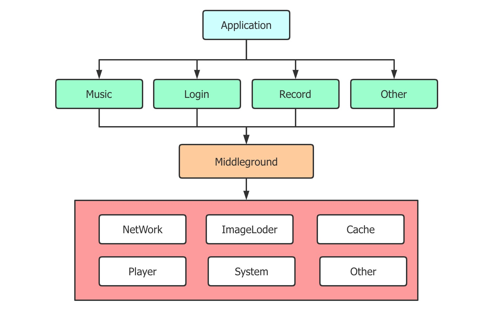

# Android Module Bridge

It is applicable to solve the communication problem between parallel modules in Android application modular development.

   Core:    Plugin: 


## is What



For a common component-based Android application, the communication capability between components at the same level is provided.For example, to communicate between the Music and Record components in the diagram above without making them dependent on each other.


## How to join

**Step 1.** Add the jcenter repository to your build file

```groovy
buildscript {
    repositories {
        ...
        jcenter()
    }
}

allprojects {
    repositories {
        ...
        jcenter()
    }
}
```


**Step 2.** Add the plugin dependency to project

```groovy
buildscript {
    dependencies {
        ...
        classpath "com.cai.open:bridge-plugin:1.0.1"
    }
}
```


**Step 3.** Add the dependency to app module

```groovy
dependencies {
	...
    implementation 'com.cai.open:bridge-core:version'
}
```


**Step 4.** Use plugin to app module

```groovy
apply plugin: 'com.cai.open.bridge-plugin'
```


## How to use

**Step 1.** Create an abstract class that inherits from the `BaseBridge` in the common module

```kotlin
abstract class MusicBridge : BaseBridge() {
    abstract fun playMusic(music: Music)
    abstract fun showActivity(context: Context)
    ...
}
```


**Step 2.** Implement the abstract class in the music module and add annotations `@Bridge`

```kotlin
@Bridge
class MusicBridgeImpl : MusicBridge() {
    override fun playMusic(music: Music) {
        MusicPlayer.play(music)
    }
}
```


**Step 3.** Use in other modules

```kotlin
playMusicBtn.setOnClickListener {
    ModuleBridge.get(MusicBridge::class.java).playMusic(popMusic)
}
```